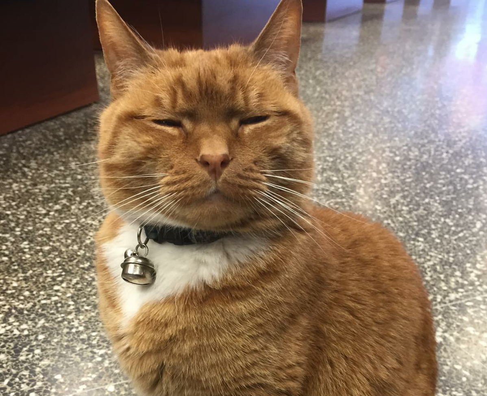

# Информация обо мне
Обучаюсь программированию на языке python

Прохожу курс "Python-разработчик с нуля" на [Нетологии](https://netology.ru/) 

## Прогресс обучения
За последнее время я достиг следующих результатов в своем обучении:

* Освоил основы языка Python.
* Научился пользоваться системой контроля версий Git.
* Освоил язык разметки Markdown.

Я готов продолжать углублять свои знания и навыки в этих областях и изучать новые технологии.

